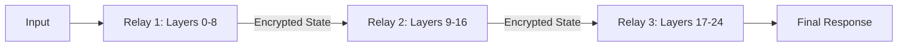

# 🌸 Polygone-Petals

**Distributed, Post-Quantum LLM Inference.**

Polygone-Petals allows you to run massive language models collectively. The network shards the model layers across multiple peers, creating a distributed inference pipeline.

## 🚀 Key Features

- **Sequential Pipelining**: Send hidden states through a series of peers, each computing a specific segment of the model.
- **Vapor Tensors™**: Hidden states are encrypted using ML-KEM before being transmitted to the next peer.
- **Collaborative Brain**: Pool your GPU/CPU power to run models that would normally not fit on a single machine.

## 🛠️ Usage

### Start a model segment relay
```bash
polygone-petals serve --layers 0-10 --listen 0.0.0.0:4003
```

### Run a chat session
```bash
polygone-petals chat --prompt "Hello, Network Brain." --relays node1:4003,node2:4003
```

## 🏗️ Architecture



## ⚖️ License
MIT License - 2026 Lévy / Polygone Ecosystem.
By Hope
